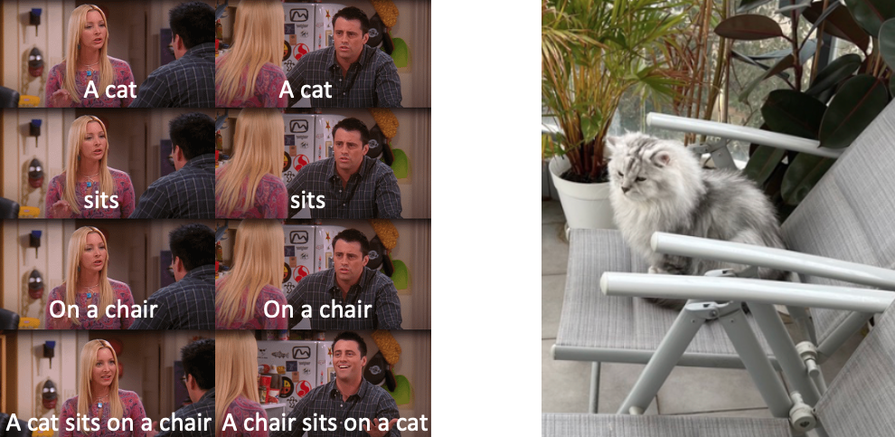

# Teaching Structured Vision & Language Concepts to Vision & Language Models

This repository contains the code for the paper "Teaching Structured Vision & Language Concepts to Vision & Language Models" ([link](https://arxiv.org/abs/2211.11733)), by Sivan Doveh et al, published at CVPR 2023.



A model checkpoint for models trained with [LLM,RB] negatives, and a zip file of the generated positives can be downloaded from this Google Drive link:https://drive.google.com/drive/folders/1WosT_kdam1ymWjVSK2ezyydLoqmm0LdX?usp=sharing  

"train_with_cap.csv" and "val_with_cap.csv" are also in the google drive ^^ 

## Installation:
### Requirements
1. Linux machine
1. At least one NVIDIA GPU
1. At least CUDA 10.2
1. Anaconda (Installation instructions: https://docs.anaconda.com/anaconda/install/)
### Install Dependencies
To install the required dependencies, first, clone the repository and navigate to the cloned directory:  
```shell script
git clone TSVLC  
cd TSVLC 
```  
Next, create and activate the conda environment:  
```shell script
conda deactivate # deactivate any active environments
conda create -n vl python=3.8.13 # install the conda environment with conda dependencies
conda activate vl # activate the environment
conda install -c conda-forge libjpeg-turbo
conda install pytorch==1.12.1 torchvision==0.13.1 cudatoolkit=11.3.1 -c pytorch
```

## Data Preparations
### Training data
Download Conceptual Captions 3M training and validation splits from https://ai.google.com/research/ConceptualCaptions/download  
After data preparation, place the data in `TSVLC/CC3M_data/training` and `TSVLC/CC3M_data/validation`  

#### Train with Positives
Download the positives from https://drive.google.com/drive/folders/1WosT_kdam1ymWjVSK2ezyydLoqmm0LdX?usp=sharing and place them in `TSVLC/CC3M_positives/`  

### Evaluation data
Prepare vl checklist dataset as described in https://github.com/om-ai-lab/VL-CheckList/blob/main/DATASETS.md  
Then move the vl dataset to `TSVLC/vl_datasets/`  
If you followed the instructions correctly, you should have the following folders inside vl_datasets: **'hake', 'swig', 'vg'**. 

## Training

### Run the training script
First, navigate to the src directory:
```shell script
cd src
```
The model will be saved in `TSVLC/Outputs/exp_name/checkpoints`

To train a network with:
* RB negative generation:
```shell script
python3 training/main.py --name exp_name --vl_negs --lora 4 --neg_type rule_based --pretrained openai
```

* RB + llm based negatives generation:
```shell script
python3 training/main.py --name exp_name --vl_negs --lora 4 --neg_type both --llm_neg_types NOUN ADP ADJ VERB --pretrained openai
```

* Positives:
```shell script
python3 training/main.py --name exp_name --vl_pos --lora 4 --pretrained openai
```

## Evaluation
### Run the evaluation script
All vl_checklist jsons will be saved in `TSVLC/eval_jsons/clip/exp_name/` and the result will be printed. 
To prepare the vl checklist evaluate results for the experiment **exp_name** run the following command:
```shell script
python3 training/main.py  --lora 4 --pretrained openai --eval_vl_cklist --eval_only --resume /path/to/checkpoint
```
